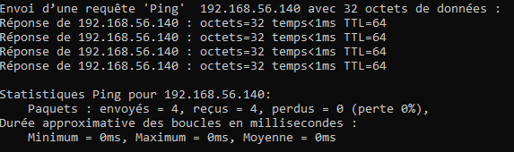
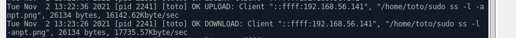
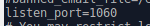
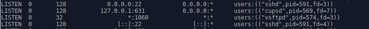
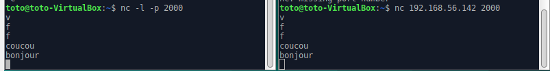
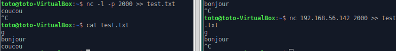

# Tp2-linux

# TP2 : Manipulation de services

Le but de ce TP est de faire notre propre service, c'est pourquoi il ce compose en 3 partie. C'est a dire qu'on va d'abord apprendre a se servir d'un service dans les deux premieres parties puis en faire un en troisième partie.

Avant tous on change le nom de la machine avec la commande ```sudo hostname node1.tp2.linux```


On change le nom de la machine quand elle s'allume ```cd /etc``` et ```sudo nano hostname``` puis on écrit node1.tp2.linux

Enfin on vérifie le réseau (l'envoie et la réception de donnée) de notre VM :

```ping 1.1.1.1``` sur VM


```ping ynov.com``` sur VM


```ping 192.168.56.140``` sur notre PC



## Partie 1 : Installation et configuration d'un service SSH

1. On installe le paquet avec la commande```sudo apt install openssh-server```

2. On lance le serveur avec la commande ```sudo systemctl start sshd``` 

3. On vérifie qu'il soit bien actif avec la commande ```sudo systemctl status sshd```


On affiche le processus liés au service ssh avec la commande ```ps -e```


On affiche le port utilisé par le service ssh avec ```sudo ss -lanpt```


On affiche les logs du service ssh avec la commande ```sudo journalctl -u ssh```

Pour ce connecter au serveur ssh depuis notre PC, il faut taper la commande ```ssh toto@192.168.56.140```

4. On va modifier le fichier sshd_config pour cela on va faire ```cd /etc/ssh``` puis ```sudo nano sshd_config```. Ensuite on modifie son port d'écoute qui est de base de 22 en 1060.

On vérifie que la modification a bien était sauvegarder avec la commande ```sudo cat sshd_config``` 


On vérifie ensuite que la modification ai était bien prise en compte avec la commande ```sudo ss -lanpt```


On peut désormé redémarrer le service avec la commande ```sudo systemctl restart sshd```

Maitenant qu'on veut se connecter au nouveau port on doit faire : ```ssh -p 1060 192.168.56.168```

## Partie 2 : FTP

1. On installe le paquet avec la commande```sudo apt install vsftpd```

2. On lance le serveur avec la commande ```sudo systemctl start vsftpd``` 

3. On vérifie qu'il soit bien actif avec la commande ```sudo systemctl status vsftpd```


On affiche le processus liés au service ssh avec la commande ```ps -e```


On affiche le port utilisé par le service ssh avec ```sudo ss -lanpt```


On affiche les logs du service ssh avec la commande ```sudo journalctl -u vsftpd```

Pour ce connecter au serveur ftp on va dans le gestionnaire de fichier ---> On rentre ```ftp://192.168.56.140```

Pour uploader et telecharger un fichier de notre PC a la VM, on fait simplement un copier coller d'un fichier de notre PC au gestionnaire de fichier connecté à la VM et inversement.

Pour verifier que cela a marché on fait ```ls``` dans le dossier ou on a copier le fichier.


Pour mettre en évidence les lignes de log du download et de l'upload il faut ce rendre dans le dossier log avec ```cd /var/log``` puis afficher le fichier "vsftpd.log" ```sudo cat vsftpd.log```.



4. On va modifier le comportement du service. Il faut donc faire ```cd /etc``` puis ```sudo nano vsftp.conf``` pour rentrer dans le fichier. Ainsi on peut changer le port d'écoute de vsftpd qui est de base 22 en 1060 en ajoutant ```listen_port=1060```. Puis pour vérifier qu'il soit bien sauvegardé on fait ```sudo cat vsftpd.conf```



Ainsi on voit si c'est modifications ont prit effet grâce a la commande ```sudo ss -lanpt```



On peut désormé redémarrer le service a l'aide de la commande ```sudo systemctl restart vsftpd```

Pour ce connecter au serveur ftp on va dans le gestionnaire de fichier ---> On rentre ```ftp://192.168.56.140:1060/```

On peut donc réutiliser la même méthode que dit précedement pour upload et download un fichier.

## Parti 3 : Création de votre propre service

1. On installe le paquet avec la commande```sudo apt-get install netcat```

2. Les deux commande pour faire un chat avec "netcat" sont : ```nc -l -p 2000``` et ```nc 192.168.56.142 2000```



Suite a cela on essaie de stocker notre discussion dans un fichier txt appellé "test.txt". A l'aide de la ```touch test.txt``` on crée le fichier. Puis en le pour le faire stocker les données échangées on fait ```nc -l -p 2000 >> test.txt``` et ```nc 192.168.56.142 2000 >> test.txt```. Pour vérifier cela suite a un échange on va afficher les données stockées par le fichier texte ```cat test.txt```.




