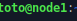

# Tp2-linux

# TP2 : Manipulation de services

Le but de ce TP est de faire notre propre service, c'est pourquoi il ce compose en 3 partie. C'est a dire qu'on va d'abord apprendre a se servir d'un service dans les deux premieres parties puis en faire un en troisième partie.

Avant tous on change le nom de la machine avec la commande ```sudo hostname node1.tp2.linux```



On change le nom de la machine quand elle s'allume ```cd /etc``` et ```sudo nano hostname``` puis on écrit node1.tp2.linux

Enfin on vérifie le réseau (l'envoie et la réception de donnée) de notre VM

```ping 1.1.1.1```


```ping ynov.com```


```ping 192.168.56.140```


Partie 1 : Installation et configuration d'un service SSH


---